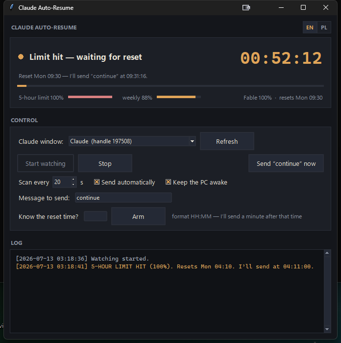

# Claude Desktop App Auto-Resume for Windows 11

**Don't let the 5-hour limit stop Claude in the middle of an overnight run.**

When your session limit runs out in the **Claude Desktop** app (Windows), work
just stops until you manually type "continue". This tool watches the Claude
window for you: it detects when the limit is hit, remembers the reset time, and
**one minute after the reset it types "continue" and presses Enter by itself**.
You come back to finished work.

It's the Windows-desktop counterpart to the popular Linux `claude-auto-retry`
(which only works in the terminal on Linux). This one drives the **Claude
desktop app on Windows 10/11**.

The interface is bilingual — **English / Polish**, switchable with the EN/PL
toggle in the top-right corner (English by default).



---

## How it works — in short

1. **Watches the Claude window** every ~20 seconds (it reads the interface the
   same way a screen reader does — no screenshots, no OCR).
2. **Checks the 5-hour limit specifically.** When the usage meter maxes out, it
   briefly opens Claude's usage panel (the circular meter in the bottom bar) and
   reads the **5-hour limit** row — ignoring the weekly and per-model limits, so
   a maxed-out weekly (e.g. Fable) limit never triggers a false alarm.
3. **Reads that limit's reset time** from the same panel (e.g. *"Resets in 45 min"*).
4. **One minute after the reset** it brings the Claude window to the front,
   clicks the chat box, types `continue` and sends. Then it re-checks the 5-hour
   limit — if it's still maxed, it retries; if it cleared, it's done.

While it waits for the reset, it also **keeps the PC from going to sleep**, so
the overnight send actually happens.

---

## Installation

### What you need

- **Windows 10 or 11**
- **Python 3.10+** — check in a terminal: `py --version`.
  (U can get it from [python.org](https://www.python.org/downloads/) and
  tick *"Add Python to PATH"* during install.)
- The **Claude Desktop** app, installed and signed in.

### Get it and run

```powershell
git clone https://github.com/MichalCholajczyk/claude-desktop-auto-resume.git
cd claude-desktop-auto-resume
```

Then just double-click **`run.bat`** — it installs the one dependency it needs
and starts the app.

Prefer to do it by hand?

```powershell
py -m pip install --user uiautomation
py claude_auto_continue.py
```

---

## First run

1. Open **Claude Desktop** and go to the conversation you want to continue.
2. Start this tool (`run.bat`). You'll see a dark panel with a big clock.
3. At the top, the **"Claude window"** field usually already shows the right
   window. If not, click **"Refresh"**.
4. **Before leaving it overnight, test the send once**: click
   **"Send «continue» now"**. If "continue" appears and sends in the Claude
   window — you're good.
5. Click **"Start watching"** and leave it running in the background.

A green lamp means "watching". When the tool detects the limit, the clock turns
into a **countdown to the send**, the lamp blinks amber, and the bar underneath
shows how much waiting is left.

> **Couldn't read the reset time?** Type it into the **"Know the reset time?"**
> field (format `HH:MM`) and click **"Arm"** — the tool will send "continue" one
> minute after that time.

### Custom message

By default the tool sends **`continue`**, but you can send anything you like.
Type your own text into the **"Message to send"** field — that exact text is
what gets sent when the limit resets (and by the "Send now" button too). Leave
it blank to fall back to `continue`.

---

## ⚠️ Important before leaving it overnight

- **Turn off automatic screen lock.** On a locked desktop, Windows won't let the
  tool simulate the keyboard, so the send will fail.
  (Settings → Accounts → Sign-in options → *"If you've been away, when should
  Windows require you to sign in again?" → Never*, and disable any
  password-protected screensaver.)
- **At send time the tool briefly takes over the keyboard** — it physically
  clicks and types into the Claude window. At night that's irrelevant; during
  the day, just don't be typing at that exact second.
- **Leave the Claude window open and not minimized.** To read the 5-hour limit
  the tool briefly opens Claude's usage panel by clicking the meter, then closes
  it and puts your mouse cursor back — this needs the window visible.
- **Leave the right conversation open** — the tool types into whatever session
  is currently showing in the Claude window.

Safety: just before sending, the tool checks that the Claude window is really in
front. If it can't bring it forward, it **won't type blindly** (it won't paste
"continue" into another app) — it retries in 5 minutes instead.

---

## Settings

Available in the app window; saved to `auto_continue_config.json`:

| Option | Default | What it does |
|---|---|---|
| Language (EN/PL toggle) | EN | interface language |
| Scan every (s) | 20 | how often the tool checks the Claude window |
| Message to send | `continue` | the text sent when the limit resets |
| Send automatically | ✔ | turn off to only get an audible alert instead of sending |
| Keep the PC awake | ✔ | blocks system and display sleep while watching |

More advanced fields — number of retries, retry spacing, the 5-hour "hit"
threshold (`limit_threshold_pct`, default 100), and how often the usage panel
may be opened (`panel_backoff_s`) — can be edited directly in
`auto_continue_config.json`.

---

## Troubleshooting

**It can't see the Claude window.** Make sure Claude Desktop is actually running
(not just in the tray) and click "Refresh".

**It keeps saying "couldn't read the usage panel".** The tool needs to click
the usage meter in Claude's bottom bar, so the Claude window must be visible
(not minimized) and reasonably sized. Bring the window up and it will recover on
the next scan.

**It's not reacting to a maxed weekly/Fable limit.** That's intentional — this
tool only acts on the **5-hour limit**. A weekly or per-model limit at 100% does
not block a normal session, so it's ignored.

**Live view in the Log.** The "Log" panel (and the `auto_continue.log` file)
show exactly what the tool sees and does — that's the first place to look when
something isn't right.

---

## Privacy & safety

The tool runs entirely **locally on your machine**. It only reads the Claude
window's interface (via the system accessibility API — the same one screen
readers use) and types a single word: "continue". It sends nothing to any
external service, doesn't log conversation content, and takes no screenshots.

---

## How it works under the hood (for the curious)

- The window (the Claude app is Electron/Chromium) is read through **Windows UI
  Automation** (the `uiautomation` package). Chromium builds its accessibility
  tree only on demand, so the tool first "wakes" it by querying the documents'
  `TextPattern`.
- **The 5-hour limit is read from Claude's own usage panel.** The bottom-bar
  meter only shows the *highest* of all your limits, so a maxed weekly Fable
  limit makes it read "100%" even when the 5-hour limit is fine. To disambiguate,
  the tool clicks the meter to open the **Usage** popover and reads the specific
  "5-hour limit" row (percentage + reset), then closes it with Escape and
  restores the cursor. It only opens the popover when the cheap bottom-bar meter
  is maxed, and backs off afterwards, to avoid flashing it constantly.
- The chat box is a control named **Prompt**; clicking it focuses the field, then
  `SendKeys("continue{Enter}")` types the message.
- State machine: `Watching → 5-hour limit hit (armed, reset time known) → Send →
  Verify → Watching` (or retry, if the 5-hour limit is still maxed).

---

## License

MIT — do whatever you want with it.
